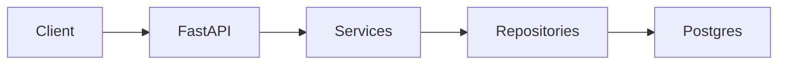

# Architecture

## Request flow (API)

HTTP handlers stay thin; **services** orchestrate validation and persistence; **repositories** encapsulate SQLAlchemy queries.

## Async job flow

1. Client creates a **score_jobs** row with status `queued`.
2. Worker loop calls `DatabaseJobQueue.dequeue_job_id()`, which **claims** one row (Postgres: `FOR UPDATE SKIP LOCKED`) and sets status `running`.
3. `run_scoring_pipeline` resolves text (inline, document, or S3), runs claim extraction, runs scorers concurrently, persists **score_results** and **score_spans**, updates job `completed` or `failed`.

## LLM interaction

- `OpenAICompatibleClient` uses **httpx** to call `/chat/completions` with `response_format: json_object`.
- Prompts require **JSON only**; `app/llm/parser.py` validates against Pydantic models.

## Data persistence

- **documents** — tenant-scoped content and metadata.
- **score_jobs** — async units of work.
- **score_results** — one row per dimension per job (`score_name`, `score_value`, `confidence`, `rationale_json`).
- **score_spans** — optional normalized issue rows linked to a result.
- **claims** — optional extracted claims for audit trails.

## Deployment model

- **Docker**: API and worker containers share the same image build pattern (PDM install prod).
- **AWS (CDK)**: VPC, S3, RDS, IAM roles, ECR, ECS cluster, CloudWatch log groups — extend with services, load balancers, and secrets wiring.
